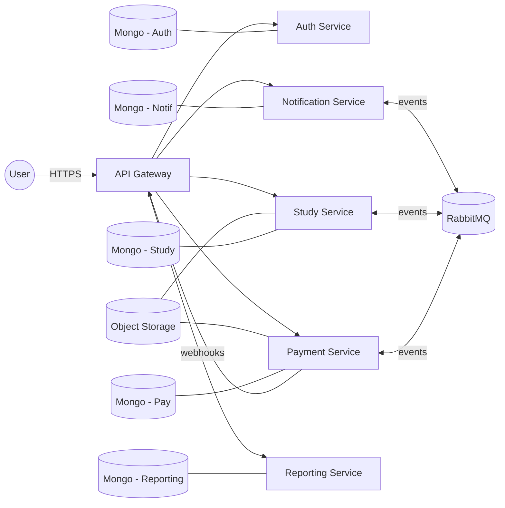
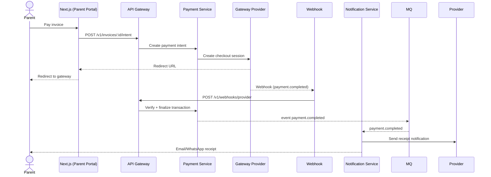
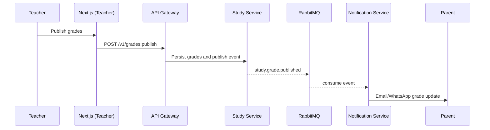

# School SAS – Architecture

This document describes the target architecture for School SAS in alignment with the PRD: modular, fault‑tolerant services with dedicated portals for Admin, Accountant, Student, Teacher, and Parent; and future AI integrations. The system targets ≥99.5% uptime, strong data protection, and scalable deployments.

## 1. Architecture Overview

- Style: Modular microservices with an API Gateway and asynchronous messaging.
- Frontend: Next.js (React) single app with role‑based areas, or multi‑app with shared UI library.
- Backend: Node.js (Express) services with TypeScript recommended for contracts and safety.
- Data: Service‑owned MongoDB databases; Redis for cache; object storage for files/receipts.
- Messaging: RabbitMQ (or Kafka) for decoupled workflows, retries, and DLQ.
- Integrations: SMTP + WhatsApp provider (e.g., Twilio/WhatsApp Business API), Razorpay/Stripe.
- Hosting: Containers (Docker) orchestrated via Kubernetes; CI/CD with environment promotions.

High‑level components:
- API Gateway / Edge: Terminates TLS, rate limits, routes to services, handles authN.
- Auth Service: Users, roles, permissions, sessions, OAuth/JWT.
- Study Service: Classes, timetables, attendance, marks, assignments, notes, circulars, diaries.
- Notification Service: Templates, audience targeting, email/WhatsApp dispatch, retries, DLQ.
- Payment Service: Fees, invoices, payment intents, gateway integration, webhooks, receipts.
- Reporting/Analytics Service: Aggregations and dashboards (admin‑facing), read‑optimized APIs.
- File/Media Service: Managed uploads for notes, attachments, receipts (S3‑compatible store).
- Audit/Events: Centralized audit trail; domain events stream for inter‑service communication.

## 2. Service Boundaries and Responsibilities

Auth Service
- Responsibilities: Authentication (JWT), optional OAuth 2.0, RBAC policy checks, password resets, audit logging (login events), impersonation (admin, optional), API keys for services.
- Data: `users`, `roles`, `role_bindings`, `sessions`, `audit_auth`.
- APIs: `/v1/auth/login`, `/v1/auth/refresh`, `/v1/auth/logout`, `/v1/auth/roles`, `/v1/auth/users`.

Study Service
- Responsibilities: CRUD for classes/sections, enrollments, timetables, attendance, assignments, marks/grades, notes, circulars, diaries; publish domain events on updates.
- Data: `students`, `teachers`, `parents`, `classes`, `sections`, `enrollments`, `attendance`, `assignments`, `submissions`, `grades`, `notes`, `circulars`, `diaries`.
- APIs: `/v1/classes`, `/v1/attendance`, `/v1/assignments`, `/v1/grades`, `/v1/circulars`, `/v1/diaries`.

Notification Service
- Responsibilities: Message composition (templates + variables), channel routing (Email/WhatsApp), async dispatch, rate limiting, retries, DLQ, provider adapters, delivery status.
- Data: `templates`, `notifications`, `channels`, `providers`, `outbox`, `delivery_state`.
- APIs: `/v1/notifications/send`, `/v1/templates`, `/v1/providers`, `/v1/notifications/{id}`.
- Events consumed: `notification.requested`, `study.grade.published`, `study.circular.published`.
- Events produced: `notification.sent`, `notification.failed`.

Payment Service
- Responsibilities: Fees catalog, invoices, payment intents, checkout sessions, webhook handlers, receipts (PDF), reconciliation, accountant review.
- Data: `fees`, `invoices`, `payment_intents`, `transactions`, `receipts`, `reconciliation`.
- APIs: `/v1/fees`, `/v1/invoices`, `/v1/payments/intent`, `/v1/webhooks/{provider}`.
- Events produced: `payment.completed`, `payment.failed`, `receipt.issued`.

Reporting/Analytics Service
- Responsibilities: Read‑optimized dashboards for admin; aggregates across services via events; class‑wise analytics, teacher performance.
- Data: `agg_class`, `agg_attendance`, `agg_grades`, `agg_payments` (event‑sourced or ETL).
- APIs: `/v1/admin/analytics/*`.

File/Media Service
- Responsibilities: Pre‑signed URLs, virus scanning (optional), lifecycle policies, metadata.
- Data: `files`, `file_refs`, `receipts` (PDF blobs in object store), `notes_assets`.
- APIs: `/v1/files/sign`, `/v1/files/{id}`.

## 3. Data Model (Key Entities)

Core
- Student: `_id`, `person`, `rollNo`, `classId`, `sectionId`, `guardianIds`, `status`.
- Parent: `_id`, `person`, `children[]`, `contacts{email, phone, whatsapp}`, consent flags.
- Teacher: `_id`, `person`, `subjects[]`, `classes[]`, employment data.
- Class/Section: `_id`, `name`, `year`, `section`, `timetable[]`.
- Enrollment: `_id`, `studentId`, `classId`, `sectionId`, `start`, `end`.

Academics
- Attendance: `_id`, `studentId`, `date`, `status`, `recordedBy`, `reason?`.
- Assignment: `_id`, `title`, `desc`, `classId`, `dueAt`, `attachments[]`.
- Submission: `_id`, `assignmentId`, `studentId`, `submittedAt`, `grade?`, `feedback?`.
- Grade: `_id`, `studentId`, `subject`, `term`, `score`, `max`, `publishedAt`.
- Circular/Diary: `_id`, `title`, `body`, `audience`, `publishedAt`, `attachments[]`.

Payments
- Fee: `_id`, `name`, `amount`, `currency`, `period`, `classId?`.
- Invoice: `_id`, `studentId`, `lineItems[]`, `total`, `dueAt`, `status`.
- PaymentIntent: `_id`, `invoiceId`, `provider`, `providerRef`, `amount`, `status`.
- Transaction: `_id`, `intentId`, `providerEvent`, `status`, `capturedAt`.
- Receipt: `_id`, `invoiceId`, `number`, `pdfRef`, `issuedAt`.

Notifications
- Template: `_id`, `name`, `channel`, `subject`, `body`, `placeholders[]`, `locale`.
- Notification: `_id`, `templateId`, `audience`, `variables`, `status`, `error?`.
- DeliveryState: `_id`, `notificationId`, `channel`, `provider`, `state`, `attempts`, `lastError?`.

## 4. API Surface (Representative)

Auth
- POST `/v1/auth/login`, POST `/v1/auth/refresh`, POST `/v1/auth/logout`
- GET `/v1/auth/me`, GET `/v1/auth/permissions`

Study
- GET `/v1/classes/:id`, GET `/v1/classes/:id/timetable`
- POST `/v1/attendance`, GET `/v1/attendance?studentId=...&from=...&to=...`
- POST `/v1/assignments`, POST `/v1/grades:publish`, GET `/v1/grades?studentId=...`
- POST `/v1/circulars`, GET `/v1/diaries?studentId=...`

Notification
- POST `/v1/notifications/send` {templateId|body, audience, channel}
- GET `/v1/notifications/:id`, POST `/v1/templates`

Payment
- POST `/v1/invoices/:id/intent` -> provider checkout session
- POST `/v1/webhooks/razorpay` (or `/stripe`), GET `/v1/receipts/:id`

Admin/Analytics
- GET `/v1/admin/analytics/class/:id`, GET `/v1/admin/analytics/teacher/:id`

Conventions
- Versioning via `/v1`.
- JWT bearer auth; role checks at service and gateway.
- Idempotency keys for POST endpoints that create payments/notifications.

## 5. Messaging and Events

Topics/Queues (RabbitMQ)
- `study.grade.published` → consumed by Notification, Reporting
- `study.circular.published` → consumed by Notification
- `attendance.recorded` → consumed by Reporting
- `notification.requested` → produced by Study/Payment; consumed by Notification
- `notification.sent` / `notification.failed` → consumed by Reporting
- `payment.intent.created`, `payment.completed`, `payment.failed` → consumed by Study/Reporting
- `user.created|updated` → consumed by Notification to maintain audience targeting cache

Reliability
- At‑least‑once delivery; consumer idempotency (dedupe keys), retry with backoff.
- DLQ per queue; poison message handling; operator visibility via dashboards.

## 6. Frontend Composition

- Next.js app with role‑based routing and layouts; server actions/API routes for BFF concerns.
- Auth via HTTP‑only cookies carrying JWT; CSRF protections on state‑changing routes.
- Shared UI and API clients; feature flags for module rollout.

## 7. Security and Compliance

- Transport: HTTPS only; HSTS; TLS 1.2+.
- Data: AES‑256 at rest (DB/object store); field‑level encryption for sensitive PII if needed.
- AuthZ: Central RBAC checks; resource‑scoped permissions; audit trails for sensitive actions.
- Secrets: Managed via cloud secrets manager; rotation policies; no secrets in repo.
- Privacy: Consent tracking for WhatsApp/email; data minimization; deletion workflows.
- Payments: Provider webhooks verified (signature), strict idempotency, PCI considerations (no card data storage).

## 8. Observability and SLOs

- Tracing: OpenTelemetry across gateway and services.
- Metrics: Request rate/latency/error, queue depth, worker success/fail, provider latency.
- Logs: Structured JSON; correlation IDs propagated via headers.
- SLOs: 99.5% availability per user‑facing API; error budget alerts; runbooks.

## 9. Deployment and DevOps

- CI: Lint, unit tests, build Docker images, SBOM, vulnerability scan.
- CD: Staged rollouts (dev→stage→prod), blue/green or canary; infra via IaC (Terraform/Helm).
- Config: 12‑factor; env‑based configuration; feature flags for module toggles.
- Data: Backups, PITR for MongoDB; migration scripts; seed data for demo.

## 10. Failure Modes and Resilience

- Timeouts, retries with jitter, circuit breakers between services.
- Bulkheads: Separate worker pools per critical queue; rate limit outbound providers.
- Degradation: If Notification or Payment fails, Study remains functional; queue messages accumulate and drain on recovery.

## 11. Example Diagrams (Mermaid)

## 12. Decisions (Locked)

- Database: MongoDB (Atlas recommended for managed ops and PITR).
- Messaging: RabbitMQ (managed via Amazon MQ or cluster on EKS).
- Cloud: AWS (containerized services on EKS/ECS; S3 for objects; Secrets Manager).
- Notifications: Twilio for WhatsApp; SMTP/SendGrid for email templates and delivery.
- Payments: Razorpay as the primary gateway; webhook verification and idempotency in Payment service.

## 13. Next Steps

- Approve open decisions and record ADRs.
- Scaffold repos/services with CI/CD, base endpoints, and health checks.
- Implement Auth + RBAC first; then Study v1; then Notification; then Payment.
